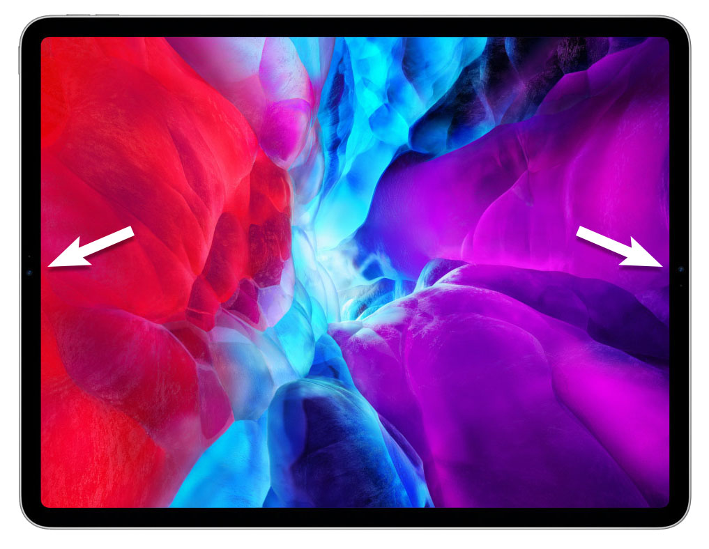

# An iPad with two front cameras - proof of concept

In my blog post [Why Apple should put a second front camera on the iPad?](https://haltakov.net/blog/ipad-with-two-front-cameras/) I wrote about how the video conferencing experience on the iPad can be improved if there was a second front camera. In this repository you will find all the code needed to run the prototype yourself.

{width: 750px}

## Preparing the images

In the folder `images` you will find my photos that I used for the experiment. If you would like to run it with your photos, you need to prepare them first.


### 1. Taking the photos

Take 2 photos of yourself by shifting the iPad horizontaly from one side to another, avoiding any rotation. Make sure that you keep as still as possible. It is important to lock the exposure control by long pressing on the image.

### 2. Scaling

Scale down the images so that they can be processed in reasonable time (and on reasonable hardware). I went down to 480 x 360 pixels, but larger sizes should work as well.

### 3. Download and compile GANet

Clone the [GANet](https://github.com/feihuzhang/GANet) repository and compile the code according to the instructions. You will need a powerful NVidia GPU (I used a GeForce RTX 2080). I used the `sceneflow` model, because the KITTI models seem to be fine tuned to street scenes and produce worse results.

### 4. Compute the disparity maps

You need to compute both the disparity maps in both directions. Since I didn't find an option to reverse the direction, I flipped both images horizontally, computed the disparity map and flipped it back (you can use the `flip_image.py` script for that). I needed to modify the Python code a little bit because I didn't want to use the lists, but directly specify the images.

Note, that the size of the crop must be a multiple of 48. I used a maximum disparity of 192 (must be multiple of 12).


## Running the scripts

### 1. Installing required packages

You need to install the `py-opencv` and `numpy` packages:

```
pip install py-opencv numpy
```

### 2. Creating a virtual image
You can use the `create_virtual_image` script to generate a new shifted image. Here is an example usage:

```
python scripts/create_virtual_image.py -i images -p images/virtual_image.png -o 0.5 -d
```

The script expects as input a folder which contains the two camera images (named `image_left.png` and `image_right.png`) and the two disparity maps (named `disp_left.png` and `disp_right.png`). The offset parameter `-o` specifies how much the virtual camera should be shifted between the left and the right camera image (0.5 means in the middle). The `-d` parameter tells the script to display the created image after it is computed.

If you want to create the "shadow" images, you need to make sure that either in the left or in the right images no correspondences can be found. Uncomment the corresponding commented lines in the `compute_virtual_camera_image_inverse` function. Sorry that this is not more user friendly...


### 3. Creating a movie

This is not very user friendly as we... Using the `create_movie` script you can render several frames at increasing offset (see the script and adapt the setting if needed). You can then use some tool to create a GIF animation (I used [GIFMaker.me](https://gifmaker.me/)).


